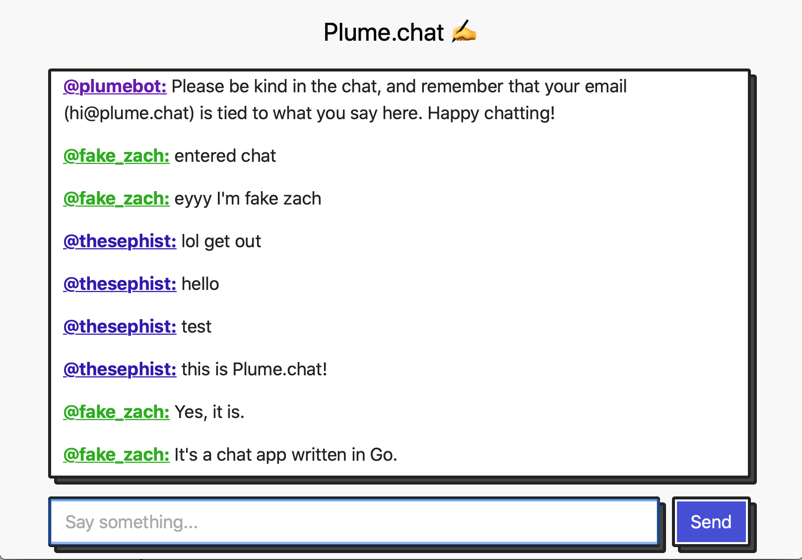

# Plume

Plume is a tiny in-memory chat server, running at [plume.chat](https://plume.chat).

Plume is built on...

- [Gorilla WebSocket](https://github.com/gorilla/websocket) for initiating and managing WebSocket connections
- [Mailgun](https://mailgun.com) to send authentication emails
- My own [blocks.css](https://thesephist.github.io/blocks.css/) to add some spice to the UI design



## Design

Plume's model consists of five types and makes substantial use of [Go channels](https://gobyexample.com/channels).

In the design of Plume's domain models, I tried to keep the chat-room related data structures (`Message`, `Client`, `Room`) separate from the protocol and lifecycle related data structures (`Server` and its related code). This leads to a bit of indirection, for example in not directly pairing WebSocket connections to `Client`s, but the abstraction boundary makes the code more readable and allows for potentially other protocols in the future to connect to a Plume chat room.

### Message

```go
type Message struct {
	Type int    `json:"type"`
	User User   `json:"user"`
	Text string `json:"text"`
}
```

The core model behind Plume is `Message` -- a type that represents all kinds of messages exchanged between clients and servers in Plume, and channels owned by servers and clients that exchange those Messages.

The client (`static/js/plume.js`) and server (`pkg/plume/server.go`) have an isomorphic (equivalent) view of messages. Each message has a `type`, which encodes non-user-visible message types like Auth handshakes; a `user` (who sent the message), and some optional `text` content.

A message represents any communication between the chat server and client (the browser). Most messages you send will be of type `msgText` (normal, text messages that are shown to everyone), but the `Message` type is also used to represent messages needed to join and authenticate to a session. You can read more about those message types below under "Client lifecycle".

### User

```go
type User struct {
	Name  string `json:"name"`
	Email string `json:"-"`
}
```

A user is a data structure representing a person with the intent to join a session, and really just contains two simple pieces of data: their username and email. The `User` type is passed around Plume's code as a container for user data, and not used for much else.

### Client

```go
type Client struct {
	User      User
	Room      *Room
	OnMessage func(Message)

	receiver chan Message
}
```

The `Client` represents a browser tab connected to a chat session, and holds most of the data structures critical for messages to be sent and received.

There can be many clients linked to the same user. If, for example, the same person logs in on two different devices or browser tabs with the same username and email, Plume represents this as two Clients with equal User values.

Each Client is linked to zero or one `Room`, which represents a collection of clients that all talk to each other. When a message is sent, that message comes through from one client, and is passed to all other clients in the Room (through `func (rm *Room) Broadcast()`). Other clients in the room will receive this message by listening to `receiver`, a channel of incoming messages.

`OnMessage` is just an API hook for any code consuming the Client-Room-Message model, like the Plume server, to do something whenever a client receives a new message. In Plume.chat, the `OnMessage` handler forwards the message content onto the WebSocket connection corresponding to the client.

### Room

```go
type Room struct {
	Sender chan<- Message
	// map of usernames to emails
	verifiedNames   map[string]string
	clientReceivers map[*Client]chan Message
}
```

A `Room` represents a collection of Clients (stored in `clientReceivers`). The Room also controls who can enter (if a new user wants to enter with an existing username claimed by someone else, for example, we'll reject.)

Most importantly, a Room holds the main channel through which new messages are broadcast: the `Room.Sender`.

### Server

```go
type Server struct {
	Room       *Room
	BotClient  *Client
	loginCodes map[string]User
}
```

The `Server` is tasked with keep track of most state about a running instance of a Plume web server. This includes the chat Room instance, a record of valid login codes and users they're associated with, and a special `@plumebot` user and client for each session, that claims the `@plumebot` username so nobody else can take it, and broadcasts any administrative messages to the whole Room.

The important state missing in `Server` is active WebSocket connections and Client lifecycle states, which are stored in closures that run as Goroutines whenever a WebSocket connection is initiated. You can find that closure defined in `server.go` as `func (srv *Server) connect()`.

## Client lifecycle

The client lifecycle is the sequence of states a Plume client (the browser) goes through, to join a chat session:

1. Every client starts out as just a simple HTTP client, no WebSocket connection.
2. When the user tries to join with a username and email, the web client (`plume.js`) opens a new WebSocket connection by making a request to `/connect`. This [upgrades](https://developer.mozilla.org/en-US/docs/Web/HTTP/Protocol_upgrade_mechanism) the HTTP connection to a WebSocket connection, but no messages are sent at this point -- the client is still unauthenticated.
3. The server either (a) sends a login code to the user through email, or (b) will respond with a `msgMayNotEnter` type message to the WebSocket client, which means that the username is taken.
4. To authenticate, the client must send the server a `msgAuth` type message with the login code as the text content.
5. If the server receives a matching login code, a `Client` instance will be created and paired to the right `Room`. At this point, the server starts forwarding any new messages between the `Client` and the WebSocket connection, and the chat can continue as normal. If the server receives an *incorrect* login code, it responds with `msgAuthRst`, which means that the code was not valid.
6. To keep the WebSocket connection alive, the server sends a WebSocket ping message every minute -- when the connection dies, the Client leaves the room and no longer responds to incoming messages.

## Deploy

Deployment is managed by systemd. Copy the `plume.service` file to `/etc/systemd/system/plume.service` and update:

- replace `plume-user` with your Linux user
- replace `/home/plume-user/plume` with your working directory (path to repository or a copy of `static/`)

Then start Plume as a service:

```sh
systemctl daemon-reload # reload systemd script
systemctl start plume   # start Plume server as a service
```